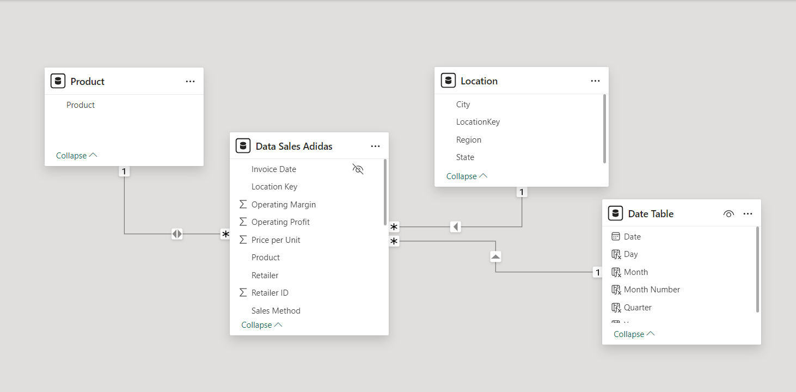
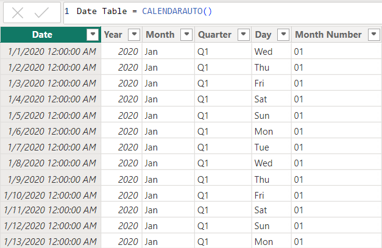
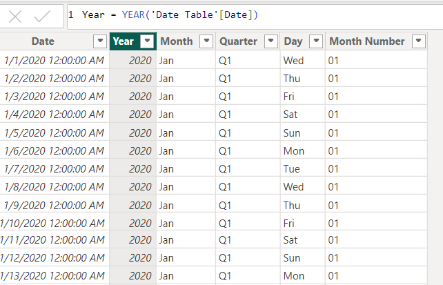
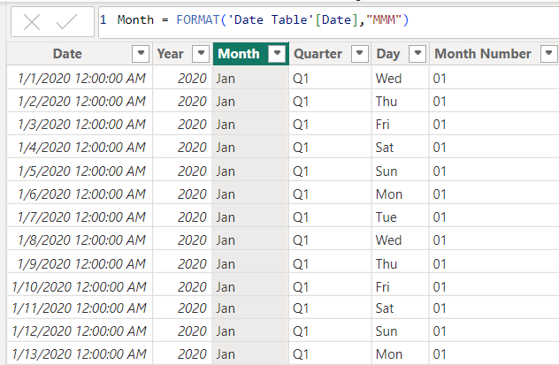
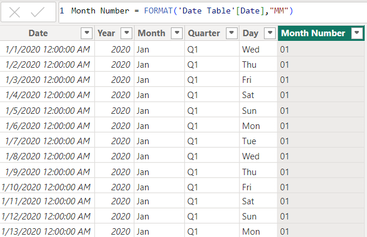
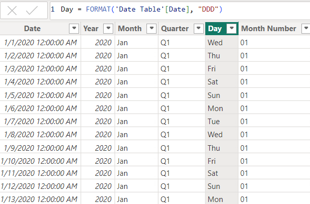

# Adidas-Sales-Analysis

## Introduction
This project is a Power BI challenge that analyses Adidas' sales performance from 2020 to 2021. The objective is to gain comprehensive insights into Adidas' sales trends across various product categories, sales channels, geographic regions, and other significant aspects of the data. The analysis leverages key performance indicators (KPIs) such as total sales, total profit, total units sold, average operating margin, total transactions, average price per unit, and month-over-month (MoM) trends. The goal is to identify patterns, provide data-driven insights for better inventory management, develop strategies to boost sales and make informed recommendations to enhance Adidas' overall business performance.

## Problem Statement
1. Which products generate the highest sales and profit?
2. What are the most effective sales channels (in-store vs. outlet vs. online)?
3. How do sales and profitability vary across different regions?
4. What trends can be identified from the month-over-month changes in sales, profit,operating margin, total transaction and other KPIs?

## Skills/Concepts demonstrated

The following Powerbi features were incorporated:
- Dax Concepts :Date Table Creation using CalendarAuto function, Extraction of year, month, day from Date Table, Calculated Columns, Measures 
- Data Modelling : Star Schema (*:1)
- Power Query for data cleaning and transformation
-callout value conditional formatting for MoMs(Month-Over-Month)
- Filters
- Tooltips

## Modelling
By default, Power BI is set to 'Autodetect new relationships after data is loaded.' However, the automatically generated relationship was disconnected, and a more appropriate relationship was manually created to ensure accurate data modeling.

Auto-Model                 |     Adjusted model
:------------------------: | :-------------------------------:
        |   

The model was a Star Schema. 
There were 3 Dimension Tables and 1 Fact Table. The Fact Table was joined to the Dimension Tables with a many-to-one relationship (*:1).

## Data Source
The dataset used for this analysis is the "Adidas US Datasets.xlsx" file, which contains detailed information about sales made by the company.
It contains 3sheets/tables:
1.	ADIDAS SALES with 9648 rows and 11 columns
2.	PRODUCT with 6 rows and 2 columns
3.	LOCATION with 54 rows and 4 columns
The dataset can be downladed [Here](https://github.com/Rolakamin/Adidas-Sales-Analysis/blob/main/adidas_%20US%20datasets.xlsx)

## Data Cleaning and Transformation
The dataset was cleaned and transformed in Power Query by:
- Removing blank rows and redundant columns
- Promoting Column headers
- Updating field data types to match the appropriate formats(e.g., date, numeric, text)
- Identifying and addressing outliers

## Data Visualization and Analysis
After completing data cleaning and transformation, a date table was established to facilitate time-based analysis.This table was grouped into hierarchical categories (Year, Month, Quarter, Day, and Month Number) for efficient filtering. Next, DAX measures were crafted to analyze and visualize critical business performance indicators, including:
- Total Sales
- Total Profit
- Sales Performance
- Profit Performance
- Unit Sold Performance
- Other Key Performance Indicators (KPIs)

### Date Hierachy and KPI Measures

Key Performance Indicators (KPIs)

The following Key Performance Indicators (KPIs) formed the basis of our analysis:
1. Total Sales: Sum of all sales transactions, broken down by:
    - Product
    - Region
    - Retailers
    - Sales Method

2. Total Profit: Sum of profit generated from sales, broken down by :
   - Region
   - Sales Method
   - Product

4. Units Sold: Total number of units sold per product category.

5. Operating Margin: Ratio of operating profit to total sales, expressed as a percentage.

6. Sales Method Performance: Comparison of sales between:
    - In-store
    - Online
    - Outlet channels

7. Total Transactions: Count of all sales transactions recorded.

8. Average Operational Margin: Average operating margin across all product categories.

9. Average Price per Unit: Average selling price per unit for each product category.

Date table and Date Hierachy Measures

To enhance the time-based analysis in this project, `CalendarAuto` function was used to automatically generate a date table. Below are the steps and fields created for year, month, quarter, day and month number

Date Table 

Year

Quarter

Month

Month Number

Day

Sales Performance Measures

The following measures evaluate sales performance and growth.

 

