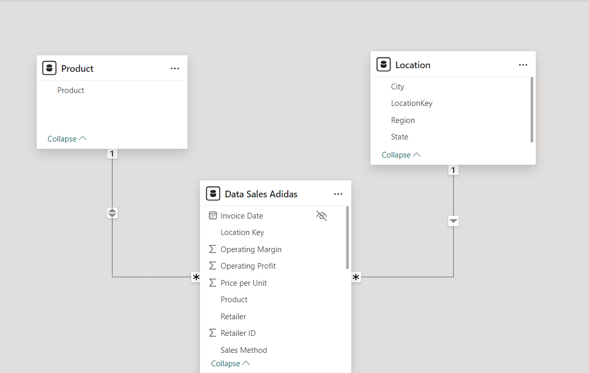

# Adidas-Sales-Analysis

## Introduction
This project is a Power BI challenge that analyses Adidas' sales performance from 2020 to 2021. The objective is to gain comprehensive insights into Adidas' sales trends across various product categories, sales channels, geographic regions, and other significant aspects of the data. The analysis leverages key performance indicators (KPIs) such as total sales, total profit, total units sold, average operating margin, total transactions, average price per unit, and month-over-month (MoM) trends. The goal is to identify patterns, provide data-driven insights for better inventory management, develop strategies to boost sales and make informed recommendations to enhance Adidas' overall business performance.

## Problem Statement
1. Which products generate the highest sales and profit?
2. What are the most effective sales channels (in-store vs. outlet vs. online)?
3. How do sales and profitability vary across different regions?
4. What trends can be identified from the month-over-month changes in sales, profit,operating margin, total transaction and other KPIs?

## Skills/Concepts demonstrated

The following Powerbi features were incorporated:
- Dax Concepts :Date Table Creation using CalendarAuto function, Extraction of year, month, day from Date Table, Calculated Columns, Measures 
- Data Modelling : Star Schema (*:1)
- Power Query for data cleaning and transformation
-callout value conditional formatting for MoMs(Month-Over-Month)
- Filters
- Tooltips

## Modelling
By default, Power BI is set to 'Autodetect new relationships after data is loaded.' However, the automatically generated relationship was disconnected, and a more appropriate relationship was manually created to ensure accurate data modeling.

Auto-Model                 |     Adjusted model
:------------------------: | :-------------------------------:
        |   

The model was a Star Schema. 
There were 3 Dimension Tables and 1 Fact Table. The Fact Table was joined to the Dimension Tables with a many-to-one relationship (*:1).

## Data Source
The dataset used for this analysis is the "Adidas US Datasets.xlsx" file, which contains detailed information about sales made by the company.
It contains 3sheets/tables:
1.	ADIDAS SALES with 9648 rows and 11 columns
2.	PRODUCT with 6 rows and 2 columns
3.	LOCATION with 54 rows and 4 columns
The dataset can be downladed [Here](https://github.com/Rolakamin/Adidas-Sales-Analysis/blob/main/adidas_%20US%20datasets.xlsx)

 

