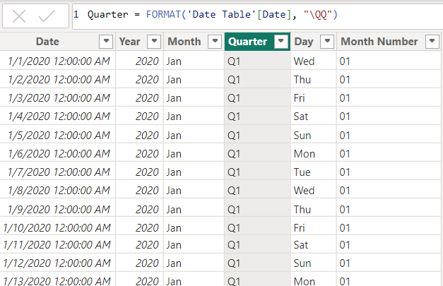

# Adidas-Sales-Analysis

## Table of Contents

1.  [Introduction](#introduction)
2.  [Problem Statement](#problem-statement)
3.  [Skills Demonstrated](#skills-demonstrated)
4.  [Modelling](#modelling)
5.  [Data Source](#data-source)
6.  [Data Cleaning and Transformation](#data-cleaning-and-transformation)
7.  [Data Visualization and Analysis](#data-visualization-and-analysis)
8.  [Findings and Observations](#findings-and-observations)
9.  [Conclusion](#conclusion)
10. [Recommendations](#recommendations)
   
    
    

***

## Introduction
This project is a Power BI challenge that analyses Adidas' sales performance from 2020 to 2021. The objective is to gain comprehensive insights into Adidas' sales trends across various product categories, sales channels, geographic regions, and other significant aspects of the data. The analysis leverages key performance indicators (KPIs) such as total sales, total profit, total units sold, average operating margin, total transactions, average price per unit, and month-over-month (MoM) trends. The goal is to identify patterns, provide data-driven insights for better inventory management, develop strategies to boost sales and make informed recommendations to enhance Adidas' overall business performance.

## Problem Statement
1. Which products generate the highest sales and profit?
2. What are the most effective sales channels (in-store vs. outlet vs. online)?
3. How do sales and profitability vary across different regions?
4. What trends can be identified from the month-over-month changes in sales, profit,operating margin, total transaction and other KPIs?

## Skills Demonstrated

The following Powerbi features were incorporated:
- Dax Concepts :Date Table Creation using CalendarAuto function, Extraction of year, month, day from Date Table, Calculated Columns, Measures 
- Data Modelling : Star Schema (*:1)
- Power Query for data cleaning and transformation
- Colour - Callout value conditional formatting for MoMs(Month-Over-Month)
  e.g Colour - Callout Value Formatting for **Average Operating Margin MoM**
  
  
  
- Filters

## Modelling
By default, Power BI is set to 'Autodetect new relationships after data is loaded.' However, the automatically generated relationship was disconnected, and a more appropriate relationship was manually created to ensure accurate data modeling.

Auto-Model                 |     Adjusted model
:------------------------: | :-------------------------------:
        |   

The model was a Star Schema. 
There were 3 Dimension Tables and 1 Fact Table. The Fact Table was joined to the Dimension Tables with a many-to-one relationship (*:1).

## Data Source
The dataset used for this analysis is the "Adidas US Datasets.xlsx" file, which contains detailed information about sales made by the company.
It contains 3sheets/tables:
1.	ADIDAS SALES with 9648 rows and 11 columns
2.	PRODUCT with 6 rows and 2 columns
3.	LOCATION with 54 rows and 4 columns
The dataset can be downladed [Here](https://github.com/Rolakamin/Adidas-Sales-Analysis/blob/main/adidas_%20US%20datasets.xlsx)

## Data Cleaning and Transformation
The dataset was cleaned and transformed in Power Query by:
- Removing blank rows and redundant columns
- Promoting headers
- Updating field data types to match the appropriate formats(e.g., date, numeric, text)
- Identifying and addressing outliers

## Data Visualization and Analysis
After completing data cleaning and transformation, a date table was established to facilitate time-based analysis.This table was grouped into hierarchical categories (Year, Month, Quarter, Day, and Month Number) for efficient filtering. Next, DAX measures were crafted to analyze and visualize critical business performance indicators, including:
- Total Sales
- Total Profit
- Sales Performance
- Profit Performance
- Unit Sold Performance
- Other Key Performance Indicators (KPIs)

### Date Hierachy and KPI Measures

**Key Performance Indicators (KPIs)**

The following _**Key Performance Indicators**_ (KPIs) formed the basis of our analysis:

 **Total Sales** : Sum of all sales transactions, broken down by:
-  Product
-  Region
-  Retailers
-  Sales Method

 **Total Profit** : Sum of profit generated from sales, broken down by:
 - Region
 - Sales Method
 - Product

 **Units Sold** : Total number of units sold per product category.

 **Operating Margin** : Ratio of operating profit to total sales, expressed as a percentage.

 **Sales Method Performance** : Comparison of sales between:
 - In-store
 - Online
 - Outlet channels

 **Total Transactions** : Count of all sales transactions recorded.

 **Average Operating Margin** : Average operating margin across all product categories.

 **Average Price per Unit** : Average selling price per unit for each product category.
 
    

**Date table and Date Hierachy Measures**

To enhance the time-based analysis in this project, `CalendarAuto` function was used to automatically generate a date table. Below are the steps and fields created for year, month, quarter, day and month number

**Date Table**

**Year**

**Quarter**

**Month**

**Month Number**

**Day**

**Sales Performance Measures**

The following measures evaluate sales performance and growth:

**Total Sales** 

**Sales MoM**

**Sales YoY**

**Units Sold Performance Measures**

This section analyzes the number of units sold, providing insights into sales volume and product demand.

**Total Units Sold**

**Unit Sold MoM**

**Unit Sold YoY**

)

**Profit Performance Measures**

This section analyzes the company's ability to generate profits by measuring key metrics that impact overall profitability and reveal how effectively sales are converted into profit.

**Total Profit**

**Profit MoM**

**Profit YoY**

**Transaction Performance Measures**

The following measures evaluate transaction volume and growth.

**Total Transactions**

**Transaction MoM**

**Transaction YoY**

Other notable performance highlights include the month-over-month (MoM) changes in average price per unit and average operating margin.

**Average Price Per Unit MoM**

**Average Operating Margin MoM**

### Data Visualization

The report is presented on one page 

You can view the dashboard [here](https://github.com/Rolakamin/Adidas-Sales-Analysis/blob/main/adidas_sales_dashboard%20.png)

## Findings and Observations

**Overall Transactions and Operating Margin**

- From 2020 to 2021, Adidas recorded a total of 9,650 transactions, with an average operating margin of 42.30%.

**Yearly Sales and Profit Summary**

- 2020: A total of 462,350 units were sold, generating $182.08 million in sales and a profit of $63.38 million. The West region led in both sales and profit, with $76.90 million in sales and $24.47 million in profit, while the Midwest region had the lowest sales and profit, at $7.38 million and $2.67 million, respectively.

- 2021: Sales performance saw a notable increase, with 2.02 million units sold, resulting in $717.82 million in total sales and $268.76 million in profit. The West region again recorded the highest sales ($193.05 million) and profit ($65.14 million), while the South had the lowest sales ($119.21 million), and the Southeast recorded the lowest profit ($48.39 million).

**Top-Performing Retailers**

-	In 2020, West Gear was the leading retailer, with $90 million in sales, while Kohl’s had the lowest sales at $1 million.
-	In 2021, Foot Locker became the top-performing retailer, achieving $177 million in sales, while Walmart had the lowest sales at $42 million.
-	Over both years, West Gear and Foot Locker collectively held the highest sales figures, with $243 million and $220.09 million in total sales, respectively.

**Top Product Categories**

- Men’s Street Footwear consistently led in both sales and profit across the two years, while Women’s Athletic Footwear had the lowest sales and profit. This suggests strong demand for men's streetwear products, 
  whereas there may be an opportunity to increase sales in the women's athletic footwear category.

**Regional Sales Performance**
- West and Northeast regions ranked as the top two regions in both sales and profitability, while the Midwest consistently recorded the lowest figures. This highlights the need for targeted strategies to boost 
  performance in lower-performing regions.

**Monthly Sales and Profit Trends**

- In 2020, April recorded the highest sales and profit, with $24.61 million and $9.30 million, respectively. The lowest sales were observed in December ($8.03 million) and June ($8.83 million), with the lowest 
  profits in June ($2.29 million) and December ($2.71 million).
- In 2021, July and December saw peak performance, with sales reaching $78.33 million and $77.82 million, respectively, and profits at $29.14 million and $28.88 million, respectively.

## Conclusion

This analysis of Adidas' sales from 2020 to 2021 provides important insights into the company’s performance across product categories, regions, sales channels, and time periods. There was a substantial increase in both total sales and total profit from 2020 to 2021, with the West region consistently emerging as the top contributor in terms of sales and profit.

Men’s Street Footwear was identified as the best-selling and most profitable product category, while in-store sales proved to be the most effective channel for both revenue generation and profitability. The findings also highlighted regional differences, with the Midwest region underperforming compared to other regions. Monthly trends revealed peak sales and profits during specific months like April, July, and December, which can guide Adidas in planning for seasonal demand.

Additionally, the month-over-month (MoM) trends provided valuable insights into seasonal fluctuations in sales, which can help inform inventory and marketing strategies. 
Overall, this analysis offers a strong foundation for data-driven decision-making, enabling Adidas to optimize inventory, refine sales approaches, and enhance overall business performance.

## Recommendations

- Expand the Men’s Street Footwear line, which performed well, and boost underperforming products like Women’s Athletic Footwear with targeted marketing or design updates.

- Improve the in-store experience (e.g., exclusive promotions, personalized service) to build on its success and consider opening more stores in high-performing areas like the West.

- Adjust inventory levels for high-demand months (April, July, December) and regions to prevent stockouts and reduce excess stock, saving costs and enhancing customer satisfaction.

- Strengthen partnerships with top retailers like West Gear through co-marketing or exclusive products, and look for ways to boost sales with lower-performing retailers.

- Increase targeted marketing efforts in regions with lower sales, like the Midwest and South, to better connect with local customers.

- Use seasonal sales trends to guide marketing, with strong campaigns around peak months and new launches or promotions during slower periods to smooth out sales throughout the year.

 

 

 

